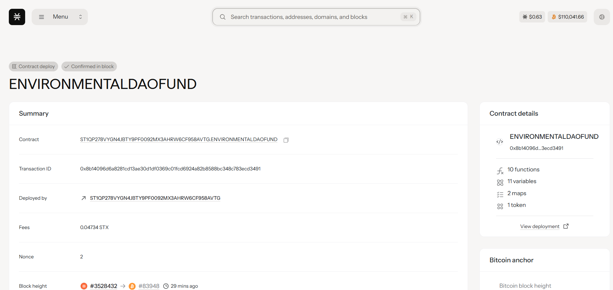

# EnvironmentalDAO Fund

## Project Description

EnvironmentalDAO Fund is a conservation funding platform supporting climate projects through community governance. Built on the Stacks blockchain using Clarity smart contracts, this decentralized platform connects environmental organizations with a global community of supporters who can directly fund climate initiatives and participate in governance decisions.

The platform operates through two core mechanisms: environmental organizations can register their conservation projects with specific funding goals, while community members can contribute STX to support these initiatives and receive governance tokens that provide voting power in future platform decisions. This creates a transparent, community-driven funding ecosystem for environmental conservation and climate action projects.

## Project Vision

Our vision is to revolutionize environmental funding by creating a decentralized, transparent, and globally accessible platform that empowers communities to directly support climate action. We envision a world where environmental conservation is funded through collective action, where every contribution matters, and where transparency and community governance drive impactful climate solutions.

**Core Values:**
- **Transparency First**: Every transaction, project, and decision is recorded on the blockchain for complete visibility
- **Community Empowerment**: Contributors become stakeholders with real voting power in platform governance
- **Global Access**: Breaking down geographical and institutional barriers to environmental funding
- **Impact-Driven**: Focusing on measurable environmental outcomes and project accountability
- **Decentralized Governance**: No single entity controls funding decisions - the community decides

## Future Scope

### Phase 1 - Foundation (Current)
- ✅ Basic project registration and funding mechanisms
- ✅ Community contribution tracking and governance token distribution
- ✅ Transparent fund management and project visibility

### Phase 2 - Enhanced Governance
- **Voting Mechanisms**: Implement community voting for project approval and fund allocation
- **Milestone-Based Funding**: Release funds based on verified project milestones and outcomes
- **Reputation System**: Build contributor and project owner reputation scores based on participation and results
- **Impact Verification**: Integration with third-party environmental impact verification services

### Phase 3 - Advanced Features
- **Multi-Category Support**: Specialized tracks for reforestation, renewable energy, ocean cleanup, wildlife conservation
- **Carbon Credit Integration**: Connect projects with carbon credit markets for additional revenue streams
- **Impact Dashboard**: Real-time tracking of environmental impact metrics across all funded projects
- **Mobile dApp**: Native mobile applications for broader accessibility and engagement

### Phase 4 - Ecosystem Expansion
- **Cross-Chain Compatibility**: Expand to Ethereum, Polygon, and other blockchain networks
- **Corporate Partnerships**: Enable corporations to meet ESG goals through platform participation
- **Educational Platform**: Resources and certification programs for environmental project management
- **API Integration**: Open APIs for third-party developers to build on the platform

### Phase 5 - Global Impact
- **Regulatory Compliance**: Align with international environmental standards and regulations
- **Institutional Integration**: Partnership with governments, NGOs, and international environmental organizations
- **Climate Data Integration**: Connect with satellite data, IoT sensors, and climate monitoring systems
- **Policy Advocacy**: Leverage community governance to influence environmental policy and climate action

### Long-term Vision (5+ Years)
- Become the leading decentralized platform for environmental funding globally
- Facilitate billions in environmental project funding through community governance
- Establish measurable impact on global climate goals through funded projects
- Create a sustainable economic model for environmental conservation
- Build a global network of environmental advocates with real governance power

## Contract Address Details
 Contract ID: ST1QP278VYGN4JBTY9PF0092MX3AHRW6CF958AVTG.ENVIRONMENTALDAOFUND
 

 
**Mainnet Deployment:**
- **Network**: Stacks Mainnet
- **Contract Address**: [To be updated after deployment]
- **Contract Name**: environmental-dao-fund
- **Deployment Transaction**: [To be updated after deployment]
- **Block Height**: [To be updated after deployment]

**Testnet Deployment:**
- **Network**: Stacks Testnet
- **Contract Address**: [To be updated after testnet deployment]
- **Contract Name**: environmental-dao-fund-testnet
- **Deployment Transaction**: [To be updated after testnet deployment]

**Contract Verification:**
- **Source Code**: Publicly available and verified on Stacks Explorer
- **Audit Status**: [To be updated after security audit]
- **License**: MIT Open Source License

---

### Quick Start Guide

**For Environmental Organizations:**
```clarity
;; Register a reforestation project
(contract-call? .environmental-dao-fund register-environmental-project 
  "Amazon Rainforest Restoration" 
  "Reforestation" 
  u100000000)
```

**For Community Contributors:**
```clarity
;; Fund project ID 1 with 1000 microSTX
(contract-call? .environmental-dao-fund fund-environmental-project u1 u1000000)
```

